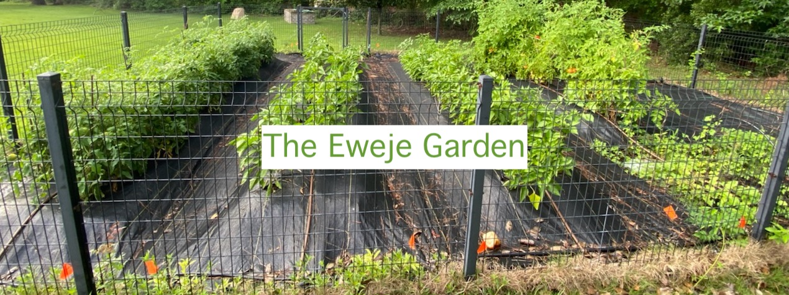
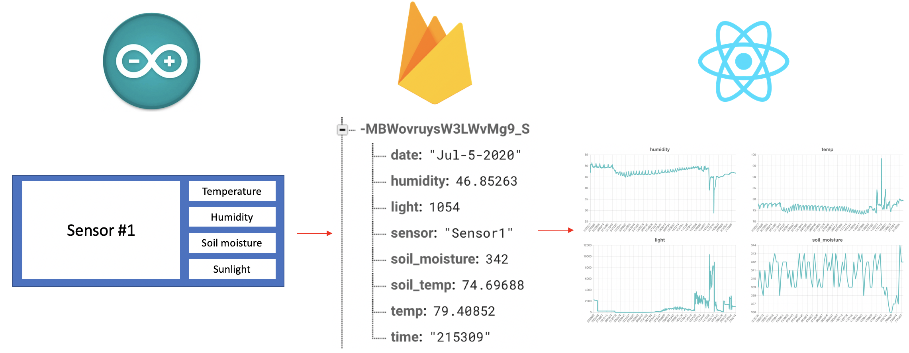
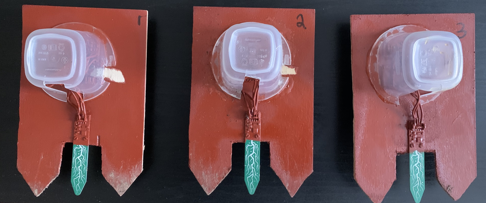

<h1>The Eweje Garden</h1>

The Eweje Garden is a React app that I built as a gift to my dad who is an avid gardener. The app accompanies ESP8266-based sensor modules I constructed to collect temperature, humidity, sunlight, and soil moisture data from different points throughout the garden and send the collected information to a real-time Firebase database over a WiFi connection. The app displays the collected data and calculates metrics that can indicate if certain parts of the garden are receiving insufficient or excessive sunlight and water. 

Live at "https://sopeeweje.github.io/eweje-garden/

<i>From the garden to Arduino to Firebase to React</i>

<h2>Materials</h2>
<h3>Electronics</h3>
<table>
  <tr>
    <th>Component</th>
    <th>Description</th>
    <th>Link</th>
  </tr>
  <tr>
    <td>Si7021 breakout</td>
    <td>Sensor to get temperature and humidity data</td>
    <td><a target="_blank" href="https://www.adafruit.com/product/3251">Adafruit</a></td>
  </tr>
  <tr>
    <td>Soil sensor</td>
    <td>Capacitive sensor to get moisture data from soil</td>
    <td><a target="_blank" href="https://www.adafruit.com/product/4026">Adafruit</a></td>
  </tr>
  <tr>
    <td>ESP8266 breakout</td>
    <td>WiFi module</td>
    <td><a target="_blank" href="https://www.adafruit.com/product/2821">Adafruit</a></td>
  </tr>
  <tr>
    <td>TSL2591 luminosity breakout</td>
    <td>Sensor to get sunlight data</td>
    <td><a target="_blank" href="https://www.adafruit.com/product/1980">Adafruit</a></td>
  </tr>
  <tr>
    <td>3xAA waterproof battery holder</td>
    <td>Battery holder for sensor module</td>
    <td><a target="_blank" href="https://www.adafruit.com/product/771">Adafruit</a></td>
  </tr>
</table>
<h3>Waterproofing/Outdoor</h3>
<table>
  <tr>
    <th>Component</th>
    <th>Description</th>
    <th>Link</th>
  </tr>
  <tr>
    <td>Urethane seal</td>
    <td>Waterproof coat for electronics</td>
    <td><a target="_blank" href="https://www.amazon.com/gp/product/B07JMVQN5K/ref=ppx_yo_dt_b_asin_title_o00_s00?ie=UTF8&psc=1">Amazon</a></td>
  </tr>
  <tr>
    <td>Plywood</td>
    <td>Mounting garden sensor package</td>
    <td><a target="_blank" href="https://www.amazon.com/gp/product/B07JMVQN5K/ref=ppx_yo_dt_b_asin_title_o00_s00?ie=UTF8&psc=1">Amazon</a></td>
  </tr>
  <tr>
    <td>Tupperware</td>
    <td>Covering electronics on garden sensor package</td>
    <td><a target="_blank" href="https://www.amazon.com/gp/product/B00N6KZMUO/ref=ppx_yo_dt_b_asin_title_o00_s00?ie=UTF8&psc=1">Amazon</a></td>
  </tr>
</table>
<h2>Sensor modules</h2>

